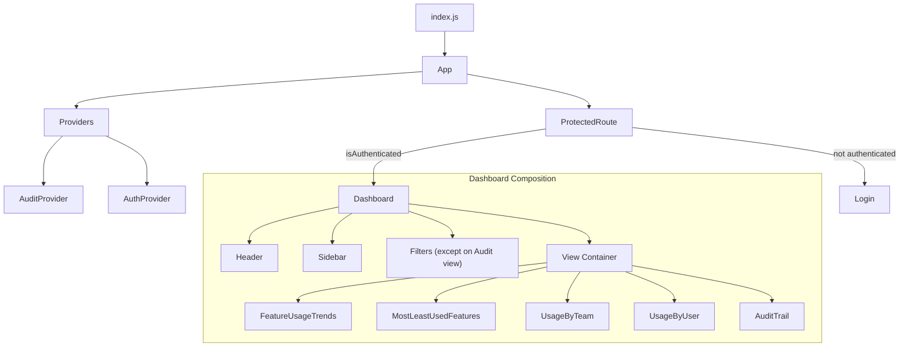

# Session Usage Insights Dashboard - Architecture

## Overview
The Session Usage Insights Dashboard is a frontend-only React application that visualizes Kavia session usage and trends for managers and Forward Deployment Engineers (FDEs). It provides interactive views for feature usage trends, most/least used features, usage by team, usage by user, and an audit trail. The application uses mock session data and a demo admin-only login to gate access to the dashboard.

This document describes the system architecture, goals and constraints, technical stack, module boundaries, component structure, state management, data model and processing, navigation, styling, testing, security, performance, accessibility, operations, known risks, and future enhancements.

## Goals and Non-Goals
### Goals
- Provide an interactive dashboard to visualize session usage, trends, and aggregates based on mock data.
- Support filtering by date range, team, feature, and user with immediate updates to visualizations.
- Enforce demo authentication for admin-only access (username: admin, password: password).
- Maintain an in-app audit trail for key actions (login/logout, filter changes, view switches, CSV exports).
- Offer CSV export for audit trail and session data subsets.
- Ensure reasonable test coverage for utilities, components, and critical flows (auth and audit).

### Non-Goals
- No backend integration or server-side persistence.
- No role-based access control beyond a single admin user.
- No URL routing or deep-linkable navigation.
- No external charting libraries; visualizations are implemented using React and CSS primitives.
- No environment-specific configuration or environment variables.

## System Context and Constraints
- Frontend-only React app (Create React App) served on port 3000 in development.
- Data is generated in-browser via a mock data generator and stored in memory.
- Authentication is purely demonstrative with hard-coded credentials.
- All state persists only for the session; refreshes clear state (no localStorage persistence).
- No URL routing is used; navigation is internal to the dashboard state.

## Technical Stack
- React 18 with Create React App (react-scripts 5).
- Testing Library (React, Jest DOM, User Event) and Jest configuration with coverage thresholds in package.json.
- ESLint (react-app preset).
- Plain CSS modules for styling; Ocean Professional palette applied via CSS files.
- No router and no external charting libraries.

## Architecture Overview
The application is initialized in index.js and renders the App component. App wraps the application with AuditProvider and AuthProvider contexts and enforces authentication through a ProtectedRoute. Upon successful authentication, the Dashboard component orchestrates layout, navigation, filters, and chosen view composition.

### High-Level Architecture Diagram

## Modules and Responsibilities
- src/index.js: Application entry point; renders App with StrictMode.
- src/App.js: Root component that composes providers (AuditProvider, AuthProvider) and enforces a ProtectedRoute to the Dashboard.
- src/context/AuthContext.js: Authentication context and hooks for login/logout; hard-coded admin credentials; logs auth actions to the audit trail.
- src/context/AuditContext.js: Audit context storing audit entries, adding entries, retrieving, and clearing entries.
- src/data/mockSessionData.js: Generates 28 days of realistic mock session data; exposes functions to get unique teams, users, and features.
- src/utils/dataProcessing.js: Provides utilities for filtering sessions, calculating feature usage, most/least used features, usage by team and user, week-over-week trends, grouping by date, and weekly trend series.
- src/utils/auditLogger.js: Utility helpers to create standardized audit entries for filter changes, view switches, CSV exports, and filter resets, with consistent ISO timestamps.
- src/utils/csvExporter.js: Converts arrays to CSV and triggers downloads; exports audit trail and session data with metadata and electronic signature placeholders.
- src/components:
  - App-level composition: Dashboard.js orchestrates header, sidebar, filters, and dynamic view rendering.
  - Authentication: Login.js renders login form and uses AuthContext for authentication.
  - Layout: Header.js shows the logged-in user and logout button; Sidebar.js provides navigation and logs view switches.
  - Filters: Filters.js provides date/team/feature/user filters with validation and audit logging.
  - Visualizations: FeatureUsageTrends.js, MostLeastUsedFeatures.js, UsageByTeam.js, UsageByUser.js transform filtered data for display.
  - Compliance: AuditTrail.js shows the audit log, with CSV export and related interactions.

## Data Model and Data Flow
### Data Model for Mock Sessions
mockSessionData exports an in-memory array of session objects. Each session includes:
- userId: string
- username: string
- projectId: string
- sessionType: "Planning" | "CodeWriting" | "Testing" | "BugFixing" | "Documentation"
- agentsUsed: string[]
- featuresUsed: string[]
- tokenUsage: number
- startTime: ISO 8601 string
- duration: number (minutes)
- outputs: { documentsGenerated: number, codeFilesUpdated: number, prsCreated: number }
- team: string

Utility selectors expose:
- getUniqueTeams(): string[]
- getUniqueUsers(): { userId, username }[]
- getUniqueFeatures(): string[]

### Data Flow
- Dashboard loads mockSessionData and maintains filteredData in component state.
- When Filters apply or reset, Dashboard uses filterSessions(...) from dataProcessing to derive filteredData.
- View components consume filteredData via props and compute display-specific aggregates locally or via dataProcessing utilities.
- CSV exports (audit or session data) are triggered from components using csvExporter utilities and are logged via auditLogger helpers.

## State Management
- Global State:
  - AuthContext: user, isAuthenticated, login(username, password), logout().
  - AuditContext: auditEntries[], addAuditEntry(entry), getAuditEntries(), clearAuditEntries().
- Component State:
  - Dashboard: currentView (trends | features | teams | users | audit), filters (object), filteredData (array).
  - Filters: controlled form fields for startDate, endDate, team, feature, userId with validation errors.
- Audit Logging:
  - Login/logout events are audited by AuthContext via addAuditEntry.
  - Filters component logs filter application and resets using logFilterChange and logFilterReset.
  - Sidebar logs view changes using logViewSwitch.
  - CSV exports log using logCsvExport where applicable.

## Navigation and Views
- No URL routing; Dashboard’s internal state manages navigation.
- Sidebar defines the set of views and triggers onViewChange with audit logging.
- Views:
  - FeatureUsageTrends: Consumes filteredData; can use week-over-week and grouped time series from dataProcessing.
  - MostLeastUsedFeatures: Uses getMostUsedFeatures and getLeastUsedFeatures to show top/bottom features.
  - UsageByTeam: Aggregates team statistics via calculateUsageByTeam.
  - UsageByUser: Aggregates and sorts user statistics via calculateUsageByUser.
  - AuditTrail: Displays audit entries from AuditContext and supports CSV export.

## Styling and Theming
- Plain CSS files in src/styles/:
  - Dashboard.css, Filters.css, Header.css, Login.css, Sidebar.css, Visualizations.css
- Ocean Professional palette is applied within CSS classes. The current setup uses static values per stylesheet.
- Optimization opportunity: define theme tokens (colors, spacing, typography) via CSS variables in a central stylesheet (e.g., :root) and reference throughout to standardize theming and simplify adjustments.

## Testing Strategy
- Unit tests for utilities (dataProcessing, validation, csvExporter, auditLogger) to verify correctness of transformations, validation logic, and CSV formatting.
- Component tests for AuditTrail, Dashboard, Filters, Login, and visualization render behaviors.
- Integration tests for authentication flow and audit context behaviors (e.g., adding entries, ordering).
- Jest configuration in package.json:
  - collectCoverageFrom excludes index.js and setupTests.js.
  - Global coverage thresholds: branches 70, functions 70, lines 75, statements 75.
- Test setup: src/setupTests.js configures Jest DOM extensions.

## Security and Compliance Considerations
- Authentication:
  - Demo-only admin login (admin/password) enforced by ProtectedRoute. All dashboard content is gated behind authentication.
  - AuthContext logs LOGIN_SUCCESS, LOGIN_FAILED, and LOGOUT to the audit trail with relevant metadata.
- Audit Trail:
  - AuditContext maintains entries with ISO timestamps, action, user, details, and optional metadata.
  - Utilities enforce consistent entry formatting; audit trail can be exported to CSV with an electronic signature placeholder (exported by user, timestamp, purpose).
  - A clearAuditEntries function exists for development/demo; in production GxP environments audit clearing should be disabled or strictly controlled.
- Data Security:
  - Application uses mock data only; no external service calls are made.
  - CSV exports occur in-browser and are user-triggered.

## Performance and Scalability
- Data set is moderate (28-day generator with daily variability); operations are within typical browser performance limits.
- Potential improvements:
  - Memoize heavy aggregates (e.g., feature usage, week-over-week series) with useMemo keyed by filteredData and filter inputs.
  - Debounce filter updates when adding interactive elements that recalculate aggregates frequently.
  - Use derived selectors to avoid recomputation for unchanged inputs.

## Accessibility
- Form controls in Filters have labels and accessible roles where appropriate.
- Sidebar uses semantic nav and aria-current for active view.
- Color usage aligns with the Ocean Professional palette; verify contrast ratios for text and critical UI elements.
- Keyboard navigation is supported via native elements; ensure focus states are visible. Additional testing can improve keyboard traversal patterns for complex visualizations.

## DevEx and Tooling
- ESLint using react-app preset.
- Scripts in package.json:
  - start: react-scripts start
  - build: react-scripts build
  - test: react-scripts test
  - test:coverage: react-scripts test --coverage --watchAll=false
- Testing libraries: @testing-library/react, @testing-library/jest-dom, @testing-library/user-event.

## Deployment and Operations
- Development server: CRA on http://localhost:3000 (or the configured environment URL).
- No environment variables required.
- No backend services or API dependencies.
- Build with react-scripts build produces a static artifact suitable for static hosting.

## Known Gaps and Risks
- No URL routing: views cannot be deep-linked, making state sharing/bookmarking impossible.
- No persistence: refreshes reset auth state, filters, and audit logs.
- Single role model: no roles beyond a demo admin; lacks fine-grained RBAC.
- Audit clearing function: clearAuditEntries is available; in regulated environments this must be restricted or disabled.
- No external charts: limits richness of visualization and interactivity compared to dedicated charting libraries.

## Future Enhancements/Roadmap
- Routing: Add react-router to enable deep-linked views and state in the URL.
- Persistence: Persist auth session, filters, and audit trail (localStorage minimally; backend or secure store ideally).
- Charting: Integrate a chart library (e.g., Recharts, Chart.js) to enhance visuals and interactivity.
- Theming: Centralize theme tokens via CSS variables and/or a CSS-in-JS solution with a design system approach.
- RBAC: Add roles and permissions (e.g., viewer vs. admin) and gate actions like audit export and clearing.
- API integration: Replace mock data with live backend APIs; add error handling, loading states, and retries.
- Performance: Memoize aggregates and implement virtualization for large tables.
- Compliance: Harden audit trail retention and export signatures for GxP production readiness.

## Appendix
### Scripts and Commands
- Install: npm install
- Start: npm start
- Test (watch): npm test
- Test (coverage): npm run test:coverage
- Build: npm run build

### Directory Structure (abridged)
- session_dashboard_frontend/
  - src/
    - App.js, App.css, index.js, index.css, setupTests.js
    - context/
      - AuthContext.js
      - AuditContext.js
    - data/
      - mockSessionData.js
    - utils/
      - dataProcessing.js
      - auditLogger.js
      - csvExporter.js
      - validation.js
    - components/
      - Dashboard.js
      - Login.js
      - Header.js
      - Sidebar.js
      - Filters.js
      - FeatureUsageTrends.js
      - MostLeastUsedFeatures.js
      - UsageByTeam.js
      - UsageByUser.js
      - AuditTrail.js
    - styles/
      - Dashboard.css
      - Filters.css
      - Header.css
      - Login.css
      - Sidebar.css
      - Visualizations.css
    - __tests__/
      - utils/
        - dataProcessing.test.js
        - validation.test.js
        - csvExporter.test.js
        - auditLogger.test.js
      - components/
        - Dashboard.test.js
        - Filters.test.js
        - Login.test.js
        - Visualizations.test.js
        - AuditTrail.test.js
      - integration/
        - AuthFlow.test.js
        - AuditTrail.test.js

### Data Processing API (selected)
- filterSessions(sessions, filters): Array
- calculateFeatureUsage(sessions): Object<feature, count>
- getMostUsedFeatures(sessions, limit): Array<{feature, count}>
- getLeastUsedFeatures(sessions, limit): Array<{feature, count}>
- calculateUsageByTeam(sessions): Object<team, stats>
- calculateUsageByUser(sessions): Array<userStats>
- calculateWeekOverWeekTrends(sessions): { currentWeek, previousWeek, trend }
- groupSessionsByDate(sessions, groupBy): Object<key, Array<session>>
- getWeeklyTrendSeries(sessions, weeks): Array<weekAgg>

